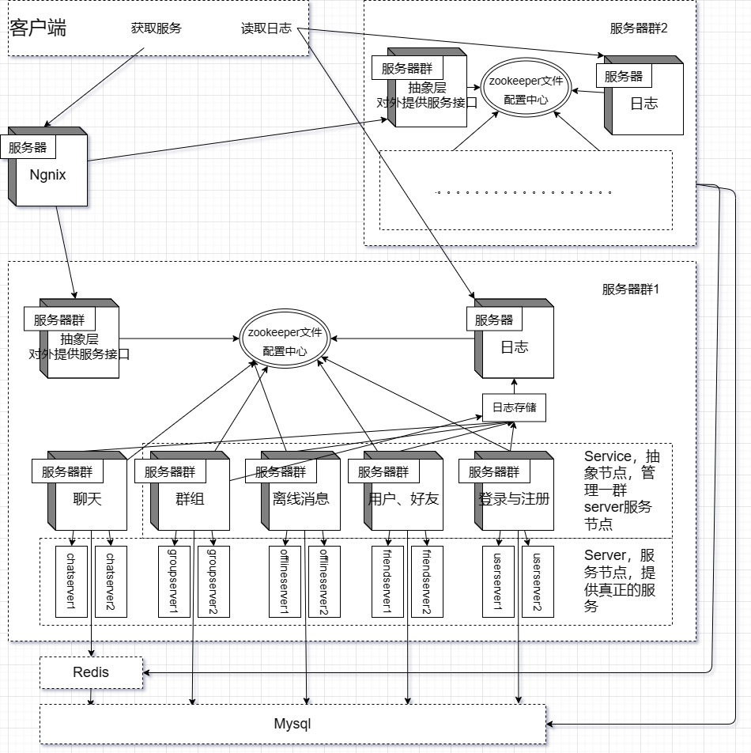

# LightTalk

* 框架图：
  * 
* 数据库表：
  * User：| 字段名称 | 字段类型 | 字段说明 | 约束 |
    | -------- | -------- | -------- | ---- |
    | id       |          |          |      |
    | name     |          |          |      |
    | password |          |          |      |
    | state    |          |          |      |
  * Friend：| 字段名称  | 字段类型 | 字段说明 | 约束 |
    | --------- | -------- | -------- | ---- |
    | user id   |          |          |      |
    | friend id |          |          |      |
  * OfflineMessage：| 字段名称 | 字段类型 | 字段说明 | 约束 |
    | -------- | -------- | -------- | ---- |
    | user id  |          |          |      |
    | message  |          |          |      |
  * AllGroup：| 字段名称   | 字段类型 | 字段说明 | 约束 |
    | ---------- | -------- | -------- | ---- |
    | group id   |          |          |      |
    | group name |          |          |      |
    | group desc |          |          |      |
  * GroupUser：| 字段名称   | 字段类型 | 字段说明 | 约束 |
    | ---------- | -------- | -------- | ---- |
    | group id   |          |          |      |
    | user id    |          |          |      |
    | group role |          |          |      |
